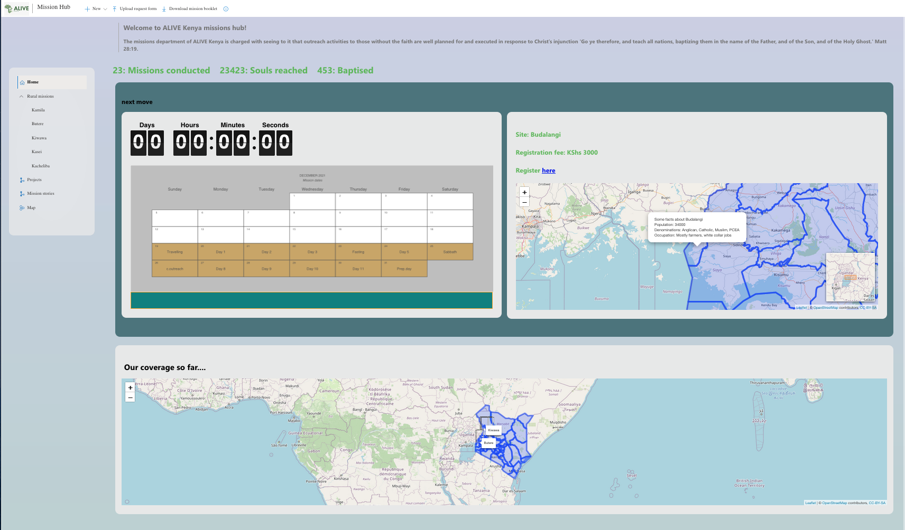

# ALIVE(K) Mission Hub  

    

ALIVE (K) is a movement of Seventh-Day Adventist students and young professionals living in view of eternity. It aims to inspire, train and mobilize Seventh-Day Adventist young adults for effective involvement in evangelism, directly impacting the African Continent.  The movement conducts missions in urban areas and to rural areas as part of its activities.   

This repository contains files for the dashboard that was developed to function as a monitoring and reporting tool for the missions department. The missions coordinator and his/her committee will use it to analyse the performance of mission activities conducted and further use the learnings thereof to plan for future endevours. The dashboard will also serve as a reporting tool such that the members can get details of missions conducted presented in a manner that is visually appealing and that communicated insights quickly and effectively. People seldom have time to cruise through five to ten page reports to get information on about certain activities, missions for this case, as such, with this tool one is able to get insights in a quick way.  

To interact with the dashboard click [here](https://limitless-sea-25544.herokuapp.com/#!/home)  
The dashboard documentation can be accessed [here](https://github.com/oyogo/documentations/tree/master/mission-hub-project)  

The following list has links to some of the frameworks and software that were used to developed the dashboard:  

  - [R](https://www.r-project.org/) : base language for statistical programming    
  - [Shiny](https://shiny.rstudio.com/) : R library for developing web applications.  
  - [shiny.fluent](https://github.com/Appsilon/shiny.fluent) : R library for creating dashboard user interface (Its a wrapper for Miscrosoft fluent UI).  
  - Other libraries which are on the app.R file.  
  
  
